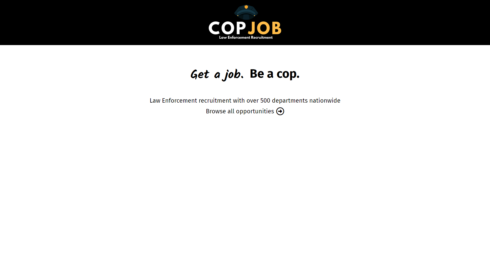
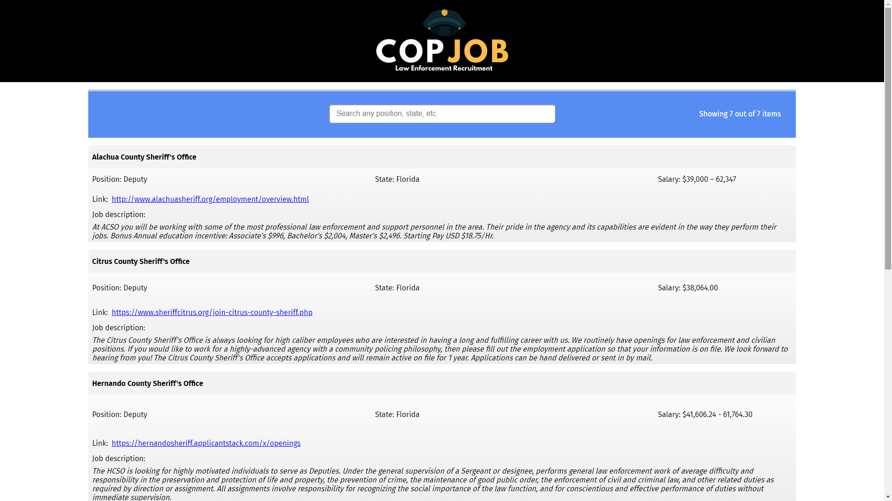
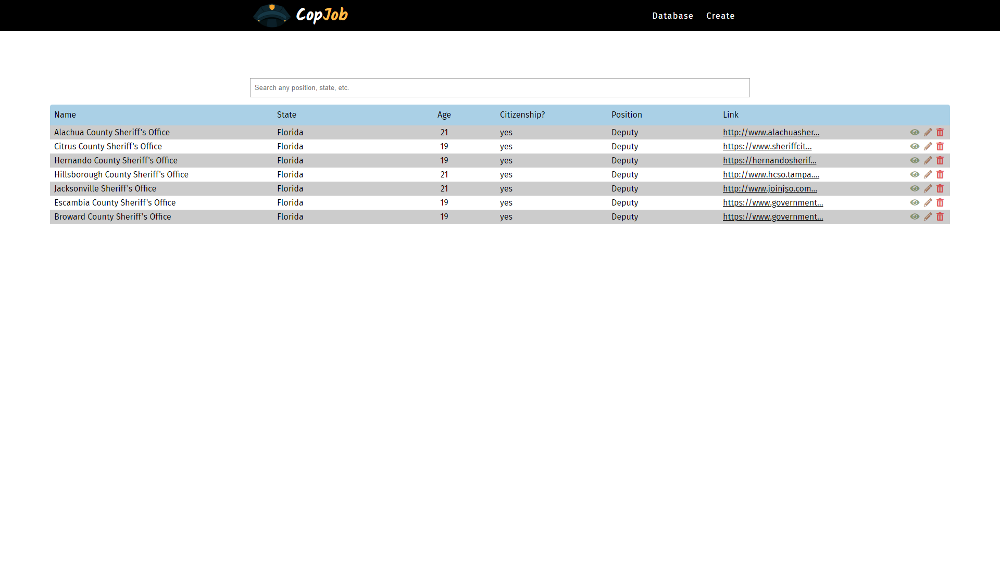
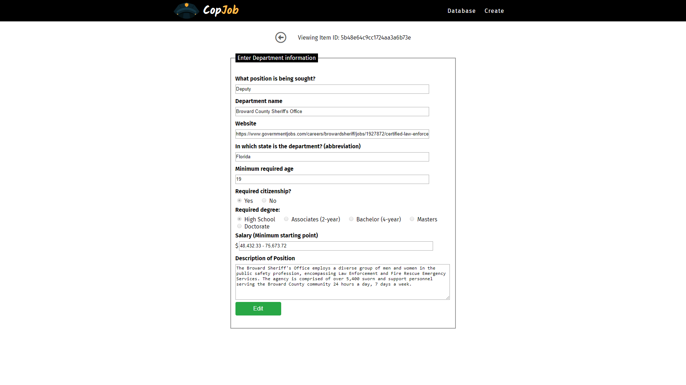
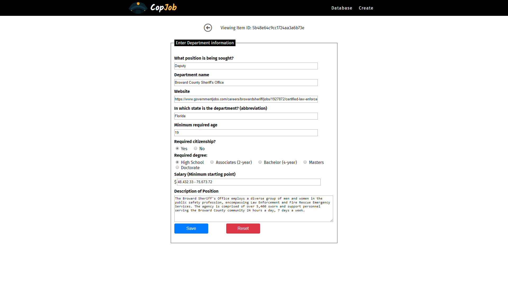

# CopJob

A national database to accumulate many independent law enforcement agencies. 

## Live Demo

[View Demo here](https://morning-brushlands-72649.herokuapp.com/)

## Summary

Upon access the user will be greeted with a message, and will continue to see all listed departments in one place. There is currently one filter option with which the user can limit the search to any *ONE* desired keyword.

The admin panel (/index & /portal) allows for CRUD operations:
* Get
* Post
* Delete
* Update

The panel's purpose is to allow for admin users to see & operate the site independently from what the front-end user sees. The common user should not have access to those editing functions.

## Screenshots

Front page:

Content page:

Edit pages:

## Built with:
### Front-End
* HTML 5
* CSS
* Javascript
* jQuery

### Back-end
* Node.js
* Express

### Database
* Mongo
* Mongoose